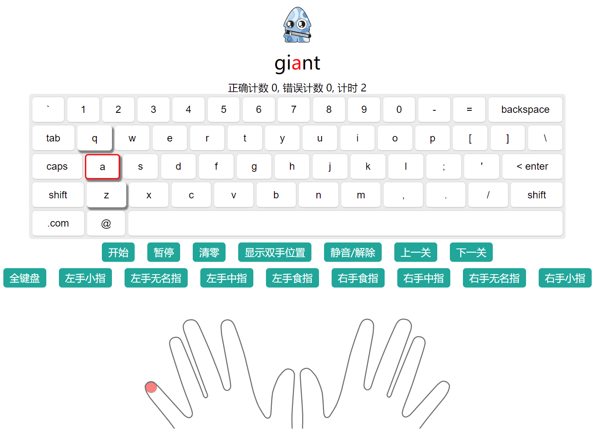

# Cute Typing
A web page to learn and practice Keyboard typing.

给小朋友写的打字游戏。可以分手指练习，具备高亮和提示，可以快速熟悉键盘指法。

[演示 Demo Page](https://rackar.github.io/cute-typing/)

点击"全键盘"，点击"开始"按钮，进行打字。如需熟悉指法，点击各手指按钮，或教程关按钮。



# install
```s
npm install
npm run serve
```

# 引用库
Vue 3   
ionic   
TypeScript   
anime.js   
howlerjs   
simple-keyboard   